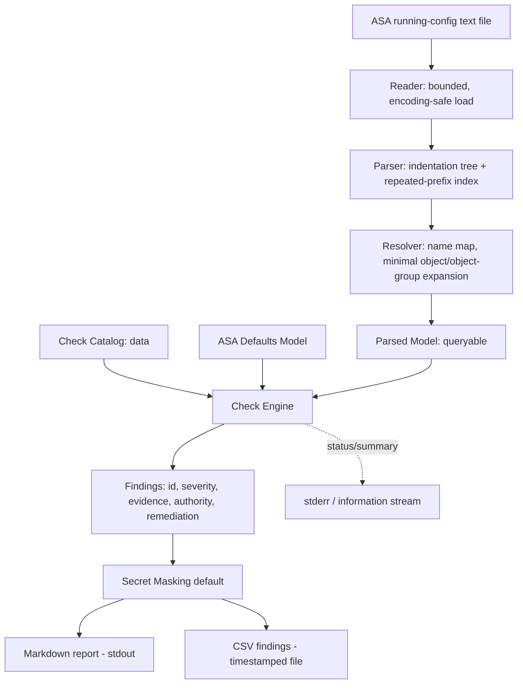
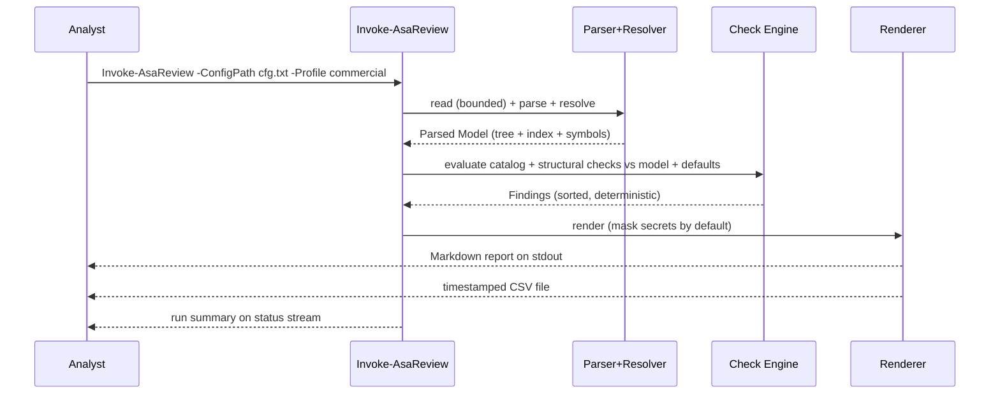

# ARCHITECTURE.md — cisco-asa-review

- **Author:** Cutaway Security (Don C. Weber) · drafted via cutsec-init
- **Date:** 2026-06-24
- **Status:** Draft (post first multi-AI pass; pre second multi-AI pass)
- **Companion docs:** VISION.md, REQUIREMENTS.md, SUCCESS_CRITERIA.md,
  CHECK_CATALOG.md, 20260624_asa-config-analysis_RESEARCH.md

This is a prose-first design doc: it explains *why* each decision was made. The
tables are the at-a-glance reference. Code-level "how" lives in module headers
and PLAN.md.

---

## §1 The shape of the system

cisco-asa-review is a pure-PowerShell pipeline that turns one ASA `show
running-config` text file into a prioritized, evidence-backed security findings
report — entirely offline, read-only, with no device and no network. What makes
it different from a generic "grep the config" script is the middle of the
pipeline: a **hierarchical parser** that rebuilds the ASA config's
indentation/reference structure into a queryable model, so checks can reason
about *nested context*, *cross-references between objects and ACLs*, and — most
importantly — *what is absent*. Most real ASA findings are missing lines
(`logging enable`, `ssh version 2`, uRPF); you cannot grep for a line that is not
there, so the system models what *should* be present and reasons over the gap.

The dominant design tension, surfaced by the first multi-AI pass, is that the
**parser is the single load-bearing component**: every check, finding, and piece
of evidence consumes the parsed model, so a parser defect corrupts everything
downstream. The architecture answers this by isolating and proving the parser
(v0.1a) before any check is built on it (v0.1b).



The five stages — **read, parse, resolve, check, render** — are separated so each
is independently testable and so output formats can be added without touching
checks (AR-01, AR-04).

---

## §2 Decision: a hierarchical parent/child model, not flat regex

**Decision.** Parse the config into an indentation tree of line nodes, plus a
separate index of repeated-prefix families.

**Alternative considered.** Flat, line-by-line regex over independent lines (what
most ad-hoc scripts and several IOS auditors do).

**Why this one.** First, ASA config encodes hierarchy purely by leading
whitespace (`interface` → `nameif`; `group-policy attributes` → `webvpn` →
`anyconnect`), and a flat scan cannot tell a child line from a sibling, so it
misreads nested crypto, policy, and group-policy blocks (RESEARCH §5). Second, the
de-facto reference parser (ciscoconfparse2) and every serious offline ASA parser
use exactly this parent/child model — it is proven prior art, and no PowerShell
implementation of it exists, which is the project's reason to exist (RESEARCH §2).

**How it could be wrong, and mitigation.** The subtlety the first review called
"the single most important design insight": some semantically-grouped constructs
(`access-list`, `crypto map`, `name`, `banner`, flat `nat`) are **NOT**
indentation children — they are flat, column-0 lines that repeat a key. A naive
tree would scatter them. Mitigation: build **two indices in one pass** — the
indentation tree for true blocks, and a repeated-prefix family index keyed on the
repeated token for flat families (CHECK_CATALOG B2). The parser keys on "has
leading whitespace" with an indent stack, never a hardcoded space count.

---

## §3 Decision: two-pass parse with a minimal resolution layer in the MVP

**Decision.** Pass 1 builds the model and a symbol table (`name` map, `object`
and `object-group` definitions). Pass 2 resolves references. **Minimal**
resolution (enough for the MVP-15 checks) ships in v0.1a; deep recursive
`group-object` nesting and unused-object hygiene ship in v0.2.

**Alternative considered.** Defer all object resolution to v0.2 (the original
draft), or resolve everything up front.

**Why this one.** The first multi-AI pass caught a real contradiction: an ACE
written `permit ip object-group ANY object-group ANY` is functionally `permit ip
any any` only *after* resolution, so the MVP `permit ip any any` check is wrong
without at least minimal resolution (anthropic CRITICAL; FR-05a). And RESEARCH §6
states the resolution layer is "mandatory, not optional" for object/ACL hygiene.
But full recursive resolution with shadowing is combinatorially heavy (OQ-C), so
resolving *everything* up front over-builds v0.1. Minimal-now/deep-later is the
balance.

**How it could be wrong, and mitigation.** The line between "minimal" and "deep"
can blur. Mitigation: each check **declares whether it reads resolved or raw
text** (FR-05a), making the dependency explicit and testable, and the `name` map
is always built first because once `names` is enabled, symbols replace IPs
everywhere (CHECK_CATALOG B5 gotcha 8).

---

## §4 Decision: declarative check catalog + structural code, boundary drawn now

**Decision.** Simple presence/absence/pattern checks are **catalog data**;
resolution-aware/structural checks (undefined references, unbound ACLs, shadowing)
are **engine code**. The boundary is drawn before checks are coded.

**Alternative considered.** All checks in code (simplest to start), or all checks
as data (impossible for structural logic).

**Why this one.** CIS/STIG benchmarks revise over time; a data-driven catalog
absorbs revisions without engine rewrites (VISION Bet 3), and lets a non-author
add a simple check by editing data (MR-01). But some checks genuinely need code.
Both reviewers pressed that "the boundary MUST be explicit" is a promise, not a
design — so the catalog carries a fixed schema and the taxonomy is fixed now:
CHECK_CATALOG A1–A3 (management/AAA/logging) are almost entirely data; A4/A5
(access-control/crypto) have several resolution-aware checks in code; the
heuristics (undefined refs, unbound ACLs, shadowing) are all code.

**Catalog schema (DR-04).** Each check: `id`, `category`, `severity`, `profile`
(commercial | dod), `authority` + `verified` flag, `pass`/`fail` pattern or
absence marker, `default_if_absent`, `rationale`, `remediation`.

**How it could be wrong, and mitigation.** The data/code line could drift until
MR-01 quietly becomes false. Mitigation: a test asserts every catalog-data check
is evaluable without engine changes; structural checks live in a named module so
the boundary is visible in the file layout.

---

## §5 Decision: reason over absence with a documented defaults model, context-conditional

**Decision.** Absence-based checks are first-class, driven by a documented ASA
9.x **defaults model** that states which settings are off/permissive when the
line is omitted. Absence checks that only matter in context are
**context-conditional**.

**Alternative considered.** Treat absence as a simple "is this global line
missing?" test (over-flags), or defer absence checks entirely to v0.3 (mistral's
proposal).

**Why this one.** A large fraction of ASA findings are absences, and several are
the highest-signal checks (no `logging enable`, no `ssh version 2`) — deferring
them to v0.3 (mistral) guts the MVP's value, so they stay in v0.1b. But a naive
"is X absent?" over-reports: uRPF absence is a finding on the outside interface,
not on a management interface (anthropic efficacy). Mitigation is the
context-conditional rule (FR-08) plus a defaults model the checks consume, tested
against ASA documentation so a misclassified default is caught.

**How it could be wrong, and mitigation.** If the defaults model is wrong, every
absence check inherits the error — and a defaults model tested only against a
fixture the team wrote has the same circularity as the parser oracle. Mitigation
(both raised by the second multi-AI pass): the defaults model is a named data
file (`data/asa-defaults.psd1`) scoped to exactly the MVP-15 absence checks, and
**each default carries a Cisco ASA 9.x documentation citation** — an external
source of truth, the way checks carry authority IDs — not just a test. It is
built in v0.1b preparation (it is check-support, not parser-proof work), gated by
a doc-cited audit, not in the v0.1a parser core.

**Interface-role model (the shared subsystem context-conditional checks need).**
Several checks need to know which interfaces are untrusted/outside (uRPF absence,
no-SSH-on-outside, outside-security-level-0). This is a single small shared model
— per interface, map `nameif` and `security-level` — designed once and consumed
by all interface-context checks, not re-derived per check. The formalized rule:
**uRPF absence is a finding if `security-level == 0` OR `nameif == outside`.** The
model MUST encode the security-level default (a named interface is 0 unless set),
or context-conditional checks misfire on configs that rely on defaults.
<!-- AI review 20260624-101250: anthropic+mistral+openai — defaults model and interface-role model were load-bearing but had no content/source-of-truth; both are second oracle-circularity risks without external citations. -->

---

## §6 Decision: secret-value masking on by default

**Decision.** The tool masks discovered secret values (passwords/hashes, SNMP
communities, AAA keys, NTP keys, PSKs) in *all* output by default; revealing them
requires an explicit opt-in flag.

**Alternative considered.** Masking as an opt-in SHOULD (the original draft).

**Why this one.** Both reviewers independently flagged that the tool's own output
— a CSV with evidence text and a Markdown report — is itself a credential-bearing
artifact. A SHOULD-masking default makes the deliverable a credential-leak vector
that contradicts the confidentiality posture (DR-01). Default-on masking is the
only posture consistent with "the config is sensitive" (SR-04).

**How it could be wrong, and mitigation.** The dangerous failure mode (second
pass, anthropic HIGH): masking can only mask what it *identifies* as a secret, so
a token-drift variant or an unparsed B6 construct leaks its secret verbatim into
the CSV while the analyst trusts the output is clean — silently inverting the
confidentiality promise. Mitigations, all required, not aspirational: (a) a
**conservative fallback mask** that redacts any line matching a broad
secret-keyword pattern (`community`, `key`, `pre-shared-key`, `password`,
`snmp-server ... v3 ... auth/priv`) even when the specific construct is not fully
parsed; (b) masking applies to **verbose/debug output too**, not just the report;
(c) a **hard gate** — no seeded secret token from the fixture appears verbatim in
default-masked output (Markdown, CSV, or verbose). Over-masking is the acceptable
direction; the opt-in `-RevealSecrets` flag exists for a trusted host, and when
set the tool emits a loud status-stream warning naming the output file as
credential-bearing. Masking replaces the value, not the surrounding evidence
line, so findings stay legible.
<!-- AI review 20260624-101250: anthropic+openai — masking is only as good as detection; added conservative fallback mask, verbose coverage, and a hard no-leak gate. -->

---

## §7 Decision: deterministic, stream-separated output

**Decision.** Findings are emitted in a defined sort order (check id, then line
number); all comparisons/sorting use `InvariantCulture`; line endings are
normalized; the Markdown report goes to stdout while status/diagnostic output
goes to a separate stream.

**Alternative considered.** Natural (hash-map) ordering and mixing status output
into stdout (the original implicit design).

**Why this one.** Repeatability (BSC-03) and cross-runtime equivalence (TSC-09)
were asserted as guarantees the design did not secure: hash-map iteration order
and culture differ across PS 5.1 and 7+, so "two analysts get identical findings"
would fail intermittently (anthropic HIGH). Determinism makes those criteria
honest. Stream separation keeps the report clean and diff-able, and lets the
Cutaway status prefixes (`[+]/[-]/[*]/[$]/[x]`) coexist with a byte-clean report.

**How it could be wrong, and mitigation.** None material; this is low-cost
hardening. The success gate was softened to "identical finding set with identical
evidence" (TSC-09) so the criterion measures what the analyst relies on, with
byte-identity as the implementation target.

---

## §7b Decision: a segmentation + data-flow visualization as a separate, always-on text output (Phase 5)

**Decision.** Add a new render-stage output that emits a **zone-level Mermaid
topology** plus a **zone-to-zone connectivity matrix** from the parsed model, as a
**separate file** written next to the config, produced on **every** run. Risky
flows (`permit ip any any`, high-severity) are highlighted with color + a label
and tied to the offending ACL line. (Decided 2026-06-24; research in
`20260624_segmentation-visualization_RESEARCH.md`.)

**Alternative considered.** Matrix-only (simpler, no topology); or a topology via
Graphviz/D2/PlantUML (needs a local binary/runtime); or embedding in the existing
report rather than a separate file.

**Why this one.** A node-link topology serves live conversations (path-following);
a matrix serves the written report (compact, exhaustive). Mermaid + a Markdown/
HTML matrix are **pure text generated offline** and render with **zero install**
in VS Code / GitLab / GitHub — so nothing leaves the host and no online tool is
used (SR-01 holds; FR-26). The two tools closest to this niche (Nipper, Cisco CDO)
visualize nothing, so this is additive. Zones reuse the interface-role model;
risk styling reuses the finding severity + evidence, so the map, matrix, findings,
and CSV speak one risk language.

**How it could be wrong, and mitigation.** (1) **Overclaiming reachability** — a
config-derived allowed-flow map is NOT end-to-end reachability (no routing/NAT/
shadowing modeled, OOS-02). Mitigation: the output states this explicitly, and
addresses not mappable to a configured zone render as an explicit `external/
unknown` zone (FR-21), never dropped. (2) **Zone-mapping ambiguity** — mapping an
ACE address to a zone (longest-prefix vs interface subnets) can be ambiguous with
overlapping/NATed/routed subnets; carry `not assessed` (OR-03) through resolution
and label ambiguous mappings rather than guessing. (3) **Graph hairball** — keep
the topology zone-aggregated and emphasize only top-N risky edges; the matrix
carries the exhaustive posture.

**New components.** `src/Get-AsaZoneModel.ps1` (zones from interface-roles +
address→zone mapping) and `src/Write-AsaSegmentation.ps1` (Mermaid + matrix
emitter, masking-aware). Both consume the existing parsed/resolved model and the
finding severities; they slot into the render stage without touching checks
(AR-01/AR-04).

**Phase 5b — consolidated HTML deliverable (decided 2026-06-24).** Because the
client has no Mermaid renderer (no GitHub/VS Code), Mermaid does not render for
them. `src/Write-AsaHtmlReport.ps1` emits a single self-contained HTML report
consolidating findings + segmentation: embedded CSS, the topology as **inline
SVG** (hand-emitted, tier-column layout), the matrix as a colored HTML table,
**no JavaScript, no external references**. *Why SVG over a JS/diagram-as-code
render:* it renders identically in any browser and prints to PDF with nothing
installed, and an HTML-with-only-SVG/CSS attachment survives strict mail gateways
that strip HTML+JS. PDF = the browser's Print -> Save as PDF (no PDF binary in the
tool). *Mitigation for the "SVG may not render as coded" risk:* the SVG is
well-formed (validated) and the rendered output is visually verified (rendered to
an image during build), not merely asserted; layout stays simple because zones
aggregate to a few nodes. The Mermaid `.md` is retained as an internal artifact
for renderer-equipped contexts.

## §7c Decision: hygiene checks via a reference index; Informational tier; CSV tracking; HTML as the full report (Phase 6 / issue #1)

**Decisions (confirmed 2026-06-24, GitHub issue #1, folded into Phase 6).**

- **Reference index (the enabler).** A single builder (`Get-AsaReferenceIndex`)
  maps each ACL, object, object-group, and time-range to every site that
  references it (access-group, crypto map `match address`, NAT, VPN filter,
  `group-object` / `network-object object` / `service-object object`, ...). The
  unused-ACL (FR-32), unused-object/object-group (FR-33), and inactive-rule
  (FR-34) checks consume it. *Why one shared index:* "unused" is only correct if
  ALL reference sites are considered — checking just `access-group` would
  false-positive on ACLs used by crypto/NAT. Building it once keeps the checks
  consistent and cheap. *How it could be wrong:* a reference site we don't scan
  yields a false "unused"; mitigation — enumerate sites explicitly and treat an
  unrecognized construct conservatively (do not assert "unused" when a token
  could be a reference). These are Informational, so a miss is low-harm and
  analyst-reviewed.

- **Informational severity tier.** Hygiene/cleanup findings (unused ACL/object,
  inactive rules, no-ip-shutdown, BVI) are **Informational** — ranked below Low,
  tracked in the CSV, shown in the report, but excluded from the High/Med/Low
  risk counts so they don't inflate the risk posture. SeverityRank gains
  Informational = 3.

- **Interface checks** (FR-35 no-ip→shutdown, FR-36 BVI) reuse the parsed
  interface blocks; BVI "used" = some interface declares a matching `bridge-group
  N`. Best-effort caveats (sub-interfaces, `ip address dhcp`, management) are
  documented so a cleanup hint is never mistaken for a hard finding.

- **CSV becomes the tracking artifact** (DR-02a): includes Informational rows and
  two team-filled columns, `RemediationState` (default Open) and
  `RemediationNotes`. Markdown stays the consolidation/AI-review text; HTML is the
  full human deliverable.

- **HTML is the complete report** (FR-37): after the summary table + segmentation
  visual, it renders the full findings detail (every finding, ALL evidence lines,
  rationale, remediation) generated natively in HTML — no Markdown-to-HTML
  conversion dependency.

- **Segmentation Markdown retired** (FR-38): the Mermaid `.md` output and
  `Write-AsaSegmentation.ps1` are removed; the segmentation visual lives only in
  the HTML (inline SVG + matrix). The zone model (`Get-AsaZoneModel`) is retained
  and now feeds only the HTML.

**Module changes.** Add `src/Get-AsaReferenceIndex.ps1`; add the five issue-#1
checks (interface/BVI in `checks/structural.ps1`; unused/inactive as
resolution-aware structural checks consuming the reference index). Remove
`src/Write-AsaSegmentation.ps1`. Extend `Write-AsaReport.ps1` (CSV columns +
Informational) and `Write-AsaHtmlReport.ps1` (full findings detail + all evidence
lines).

## §8 Cross-cutting concerns

**Security / trust boundary.** Exactly one untrusted input: the config text file
(IR-01). No network (SR-01), no device, read-only (SR-02). Config content is
processed as inert text — no `Invoke-Expression` or dynamic evaluation (SR-06).
Bundled data files (`check-catalog.psd1`, `asa-defaults.psd1`, `asa-eol.psd1`)
are loaded with **`Import-PowerShellDataFile`** (data-only parse) and never
dot-sourced or `Invoke-Expression`'d — a dot-sourced `.psd1` is a code-execution
vector. Input is resource-bounded against malformed/hostile files with **concrete
thresholds** (SR-07): max file size ~10 MB, max single-line length ~4 KB, max
nesting depth ~10 levels (starting points to validate against real configs),
bounded reads, and compiled regex with no catastrophic backtracking. The offline
guarantee is precise: the tool performs no egress; what happens to the report
after it is written is the analyst's responsibility (state this in the
deliverable).
<!-- AI review 20260624-101250: anthropic+mistral+openai — named the safe .psd1 load API and gave SR-07 concrete bounds. -->

**Error handling.** Per powershell.md: `-ErrorAction Stop` on individual cmdlets,
try/catch around fallible operations, meaningful exit codes (0 = ran, non-zero =
unreadable/empty/non-ASA input per FR-17). Checks that cannot be evaluated (e.g.,
version line absent) are reported as explicit "not assessed," never silently
skipped (OR-03).

**Observability.** A run summary (file, line count, checks evaluated, findings by
severity) on the status stream (OR-01); a verbose mode that dumps parser
decisions for troubleshooting a misparse (OR-04), available from v0.1a since the
parser ships before checks.

**Cost.** No runtime cost (offline, local). The only "cost" is development time,
concentrated in the parser and the fixture.

---

## §9 Module layout

```
cisco-asa-review/
    Invoke-AsaReview.ps1        # entry point: params, orchestration, exit codes
    src/
        Read-AsaConfig.ps1      # bounded, encoding-safe file load (SR-07)
        ConvertTo-AsaModel.ps1  # parser: indentation tree + repeated-prefix index
        Resolve-AsaReferences.ps1 # name map + minimal->deep object/group resolution
        Get-AsaInterfaceRoles.ps1 # shared interface-role model (nameif+sec-level)
        Get-AsaDefaults.ps1     # ASA 9.x defaults model (absence reasoning, v0.1b)
        Invoke-AsaChecks.ps1    # check engine: consumes catalog + model -> findings
        checks/
            structural.ps1      # resolution-aware/structural checks (code)
        Write-AsaReport.ps1     # Markdown + CSV renderers, secret masking
        Get-AsaReferenceIndex.ps1 # ACL/object/object-group/time-range -> reference sites (Phase 6)
        Get-AsaZoneModel.ps1    # zones (interface-roles) + address->zone mapping (Phase 5)
        Write-AsaHtmlReport.ps1 # self-contained HTML deliverable: findings + inline-SVG topology + matrix (Phase 5b; full report Phase 6)
        # Write-AsaSegmentation.ps1 -- REMOVED in Phase 6 (segmentation lives in the HTML only)
    data/
        check-catalog.psd1      # declarative check catalog (DR-04 schema)
        asa-defaults.psd1       # defaults model, doc-cited, MVP-15 scope (v0.1b)
        asa-eol.psd1            # version/EoL lookup table (v0.2, DR-05)
    tests/
        fixtures/               # synthesized faithful config + real sanitized configs
        *.Tests.ps1             # Pester parser + check unit tests
    README.md
    claude-dev/                 # planning docs
```

**Components**

| Component | Purpose | Technology |
|-----------|---------|------------|
| Reader | Load config text safely, bounded | PowerShell, .NET IO |
| Parser | Build indentation tree + prefix index | PowerShell, compiled regex |
| Resolver | Expand `name`/object/object-group refs | PowerShell |
| Defaults model | Encode ASA 9.x default/absent semantics | PowerShell data |
| Check engine | Evaluate catalog + structural checks | PowerShell |
| Check catalog | Declarative check definitions | PowerShell data (`.psd1`) |
| Renderer | Markdown + CSV, secret masking | PowerShell |
| Test suite | Parser + check validation | Pester |

**Technology stack**

| Layer | Technology | Version |
|-------|-----------|---------|
| Language | PowerShell | 5.1 floor, 7+ compatible |
| Modules | none (built-in only) | — |
| Test framework | Pester | 5.x (dev only) |
| Output | Markdown + CSV | — |

---

## §10 Configuration

Configuration is command-line parameters on the entry script (no config file
needed to run):

| Parameter | Purpose |
|-----------|---------|
| `-ConfigPath` | Path to the ASA config file (required) |
| `-OutputDirectory` | Where the timestamped report/CSV are written (default: the configuration file's own directory; the config is never overwritten) |
| `-Profile` | `commercial` (default) or `dod` check profile (FR-19) |
| `-RevealSecrets` | Opt-in to disable default secret masking (SR-04) |
| `-Verbose` | Dump parser decisions for misparse troubleshooting (OR-04) |

The check catalog (`data/check-catalog.psd1`) and EoL table (`data/asa-eol.psd1`)
are bundled data, never network-loaded (IR-03). The EoL table is a *dated
snapshot*; refreshing it is the job of the separate, opt-in `Update-AsaEolData.ps1`
(repo root) — the only script in the project that uses the network. It is
deliberately outside the review path: it lives outside `src/`, the entry point
never calls it, and a Guard test (`Guard.Tests.ps1`) asserts that neither the
entry point nor any `src/` file invokes it, so a config review stays fully offline
(SR-01) regardless of the updater's existence. Its behavior is fetch-or-fallback:
pull an EoL feed and rewrite the table, or — if unreachable/invalid — leave the
bundled snapshot in place.

---

## §11 Data flow



---

## §12 Constraints

- **Platform:** Windows PowerShell 5.1 is the feature floor; must also run on
  PowerShell 7+ on Windows. No installed modules; built-in cmdlets only. (R3,
  NFR-01/02/05)
- **Offline/read-only:** no network of any kind; reads input, writes only
  report/CSV where directed; never modifies input or any device. (R4, R5, SR-01/02)
- **No dynamic execution** of config content; resource-bounded input handling.
  (SR-06, SR-07)
- **Determinism:** sorted findings, InvariantCulture, normalized line endings,
  separated streams. (NFR-06)
- **Input contract:** Cisco ASA 9.x `show running-config` text; tolerate CRLF/LF
  and a leading `: Saved`/`: Hardware:` header. (IR-01)
- **Output:** Markdown (stdout) + timestamped CSV; no emoji/Unicode symbols; no
  spaces in filenames. (R2, DR-03, MR-04)

---

## §13 Failure modes

| Failure | Surfaced by | Recovery |
|---------|-------------|----------|
| Unreadable/empty/non-ASA input | FR-17 input validation | Non-zero exit + explanation |
| Oversized/hostile file | SR-07 size guard | Graceful fail before memory exhaustion |
| Misparsed nested block | Parser unit tests (TR-03), verbose dump | Fix parser; gate blocks release |
| Parser chokes on real config | TR-07 real-config gate | Fix before v0.1a ships |
| Misclassified password hash | Credential classifier tests (TSC-05) | Highest-severity miss; dedicated tests |
| Over-flagged absence finding | Context-conditional rule + TN fixtures | Scope the check to its context |
| Stale EoL data | DR-05 source/revision label | Visible staleness; manual table update |
| Authority ID drift | SR-05 evidence-first | Finding stands on evidence, not ID |

---

## §14 Version boundary

<!-- AI review 20260624-101250: anthropic+openai — v0.1a narrowed to the structural parser core; classifier/defaults/resolution are check-enablement and moved to v0.1b prep so they don't share the parser gate. -->
- **v0.1a-core:** reader + indentation tree + repeated-prefix index + `name` map +
  verbose dump. Gate: 100% parser tests (TR-03) + clean parse of 2 real configs
  (TR-07, operationally defined). This is the load-bearing slice proven in
  isolation; password classification, minimal resolution, and the defaults model
  are NOT in this gate (different failure modes).
- **v0.1b:** v0.1b-prep (minimal resolution + password classifier + doc-cited
  defaults model + interface-role model, each gated separately) then the MVP-15
  checks (presence + context-conditional absence) + Markdown/CSV + default masking
  + run summary. Gate: exact seeded TP / zero FP + the secret-masking no-leak gate.
- **v0.2:** full CIS/STIG catalog, deep resolution, undefined-ref/unbound-ACL
  heuristics, second independent fixture, version/EoL table.
- **Phase 5 (segmentation visualization):** zone model + address→zone mapping;
  Mermaid topology + zone-to-zone matrix as a separate always-on output; ANY/ANY
  and high-severity flows highlighted and tied to the offending ACL line. Pure
  offline text emission (FR-20..FR-26). Can land alongside or ahead of the rest
  of v0.2.
- **v0.3:** ACL shadowing/redundancy, large-config performance, baseline/suppression.

---

## §15 Open questions

- **OQ-1 (defaults model completeness).** How many ASA defaults must be encoded
  for v0.1b absence checks without over-building? Resolve by scoping the defaults
  model to exactly the MVP-15 absence checks first.
- **OQ-2 (catalog format).** `.psd1` data files vs an embedded here-string table —
  `.psd1` chosen for native parse and no-eval safety (SR-06); revisit if it
  becomes unwieldy.
- **OQ-3 (real-config sourcing) — RESOLVED by second pass.** TR-07 needs
  sanitized configs. They MUST be obtained and **stored locally as a one-time
  manual step** (committed only if licensing permits) — *never* fetched over the
  network at dev time, because that contradicts the air-gapped posture (SR-01/
  OP-03) and makes the gate non-reproducible. If two committable configs cannot
  be obtained, the fallback gate is N independently-authored fixtures by a second
  person, explicitly labeled a weaker oracle in release notes.
  <!-- AI review 20260624-101250: anthropic CRITICAL — dev-time fetch contradicted the offline posture. -->
- **OQ-4 (shadowing depth).** How far to take ACL overlap analysis in v0.3 before
  diminishing returns — start with exact/obvious redundancy (ASA-ACL-toolkit
  style), defer full overlap modeling.
